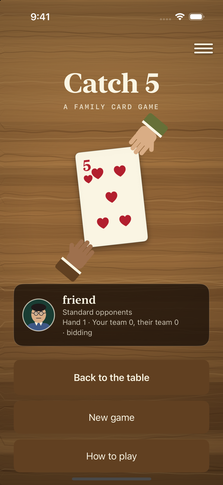
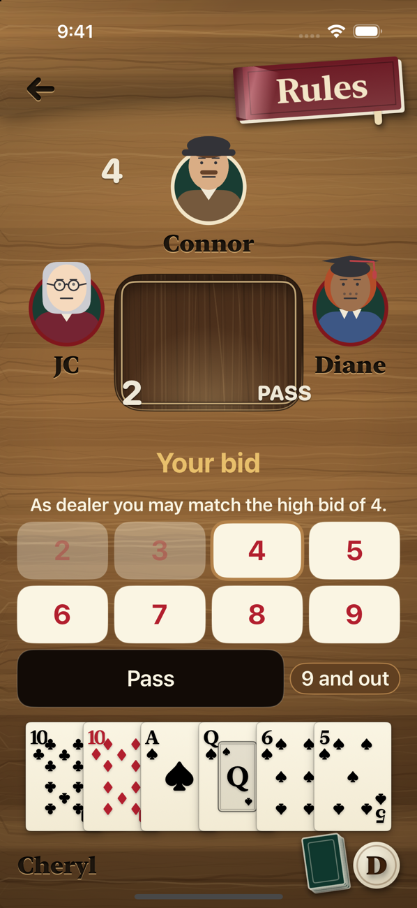
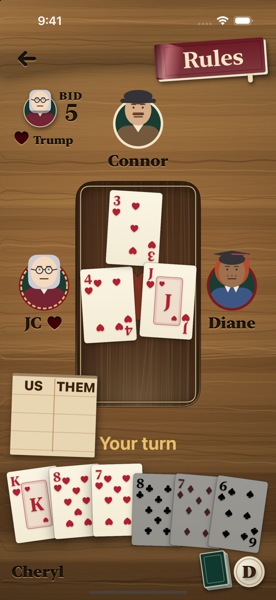
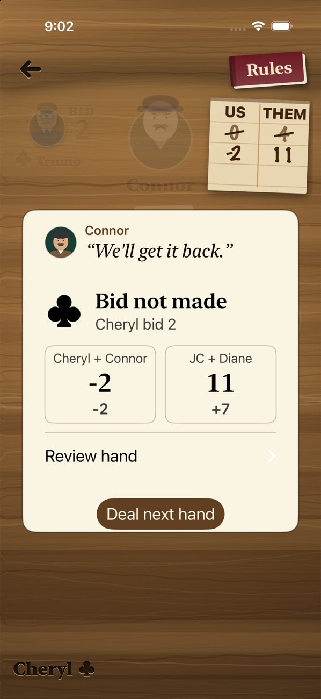

# Catch 5

[](https://github.com/cmurphy1140/catch-5/actions/workflows/tests.yml)

A SwiftUI iPhone card game, built for a new family member who is learning Catch 5 (Pitch with Fives). It plays the family's house rules (partnerships, first to 25, a 9-and-out bid) against three computer opponents, and teaches the game as you play.

<p>
  
  
  
  
</p>

## Features

- Solo play against three computer opponents (Easy and Standard), or pass-and-play on one phone.
- Hints, hand review with an explanation of every play, undo, and match statistics.
- Optional lessons and rule trials that use the same engine as the game.
- Save and resume from a replay log, so a match restores in any phase.
- Computer bidding tuned against a mirrored benchmark: win rate rose from 64.7% to 67.5% (decisions).

## Architecture

MVVM, in a Swift package with no external dependencies (iOS 17+ / macOS 14+).

- `Sources/CatchFive/` is the rules engine: dealing, bidding, tricks, scoring, computer players and saving. It has no UI code.
- `Sources/CatchFiveUI/` holds the SwiftUI views; `GameModel` is the view model that connects them to the engine.
- `App/` is the iPhone app entry point; `Sources/CatchFiveDemo/` is a terminal demo of the engine.

More: architecture, game flow, decisions.

## Build and test

```bash
swift test                            # 260 tests: 90 engine, 170 view model
python3 scripts/build-simulator.py    # builds work/simulator-build/CatchFive.app
```

The same tests run in GitHub Actions on pushes to `main` and on pull requests. Details: testing and build and run. To run on a phone, see the device guide.

## Docs

Documentation index | house rules | ideas | [contributor notes](AGENTS.md) | internal project notes
